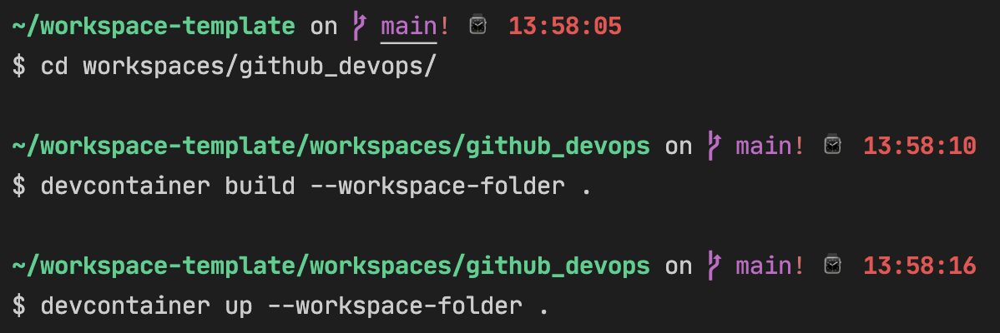
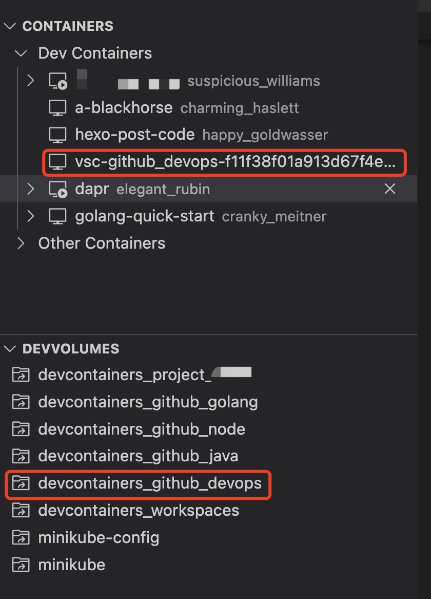
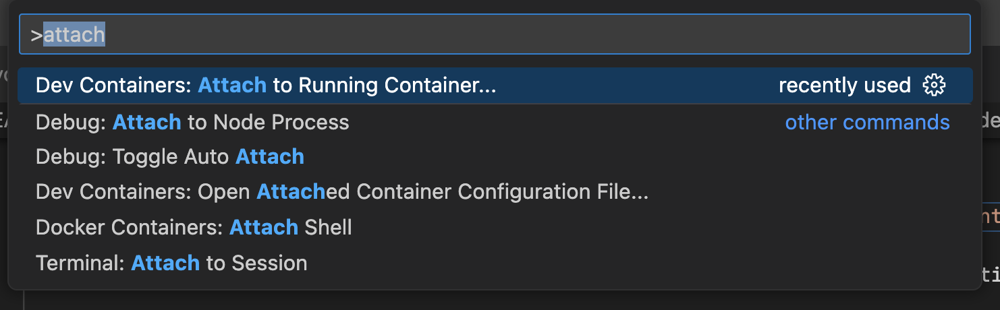
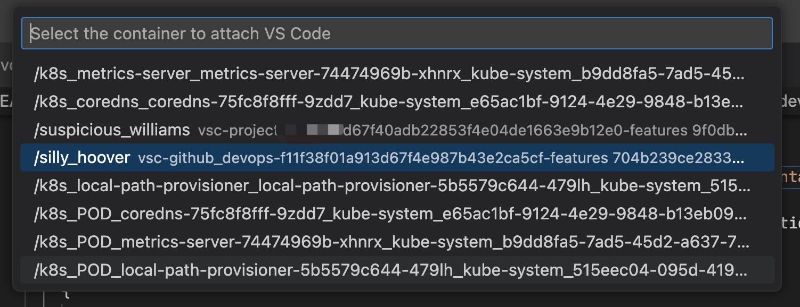
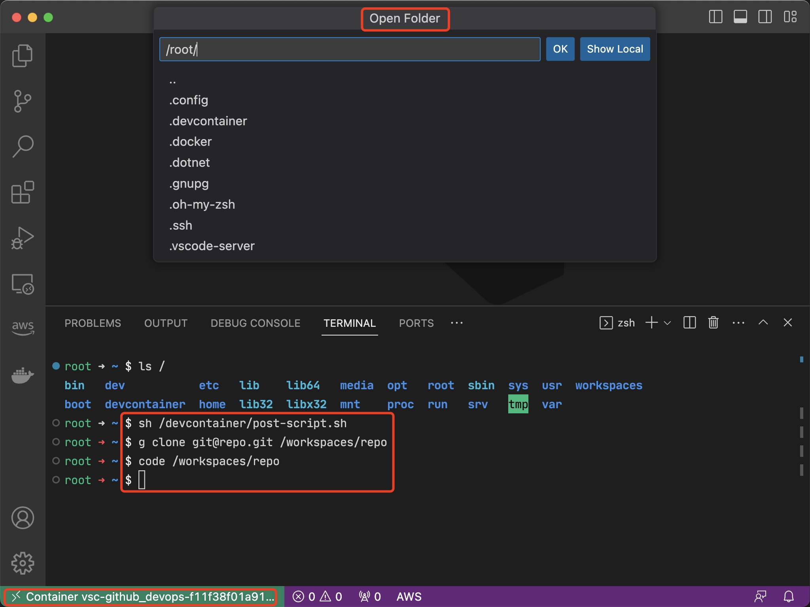

# Setup your workspaces via code (Workspace as Code ??)


Describe and manage your workspace (PC, Applications, CLIs, Environment and Projects)

e.g. Clone and work on projects at MacBook and Windows(WSL)
e.g. Start a new project & leave a project
e.g. Help junior to setup the environment

How to keep your computer clear? How to quick setup the dev environments?

> Intro: [“在我的电脑上明明可以的” — 图解 DevContainer 构建干净的开发环境](https://zhuanlan.zhihu.com/p/604545087)

## What should have in a developer workspace?

### Global tools

installed in the specific OS via command line or installer, for common use scenarios.

e.g. VSCode, Fig, 1password, docker
e.g. brew, zsh, git

### Project (Dev) Environment

a development environment for a project, e.g. sdk, packages, cli.
project members need to configure such an environment in order to develop.

e.g. go1.18, go1.20, java11
e.g. a web application with postgres

## Expectation

All those thing can reuse, extend, modify and delete quickly in cross-platform.

### Solutions - v1

- devcontainer (with VSCode Plugin)
- a cli to list and install tools base on a configuration file
- ...

### 'Workspaces' Definition

#### Local (host on OS)

- MacOS
  - take notes or write blogs in markdown or plaintext
  - basic tools to do quick verification, no compile
- Windows
  - play games :)

> install via `.setup`
> TODO a self-built tool to download and install local tools

#### Project/Dev Environment

Create different containers for different purposes with devcontainers.

- workspaces (just for demo and tutorial)
  - learning, research, test and verify the solutions
  - multiple language, always latest version
- github_golang
  - dev environment for open-source repos, e.g. kubernetes/nocalhost/terraform
  - create environment and clone repos inside container
- github_node
  - dev env for frontend repos
  - create environment and clone repos inside container
- github_java
  - ...
- github_devops
  - ...
- project_confidential_xxxx
  - individual vscode profile (enable/disable extensions)
  - individual devcontainers with all required tools
  - can be easily modified or delete

> install via `workspaces/*/.devcontainer`

``` shell
cd workspaces/github_golang
devcontainer up --workspace-folder .
```

## Cheatsheet

- Download VSCode in china, modify host to `vscode.cdn.azure.cn` to speed up

## Cheatsheet for devcontainers

- Quick start with a prebuild images and features
  - <https://github.com/devcontainers/images/tree/main/src>
  - <https://containers.dev/features>
- Share ssh credentials to containers
  - `ssh-add $HOME/.ssh/github_rsa`
- Install devcontainer cli to build/up, more quick starting with docker image
  - `devcontainer build --workspace-folder .`
  - `devcontainer up --workspace-folder .`
- Add shell script under workspace, find and exec it inside container path `/devcontainer`
  - Start with dockerfile
- Create a named volume for each container, 'persist' your workspace to avoid deletion during rebuild container

  - ```json
    {
      "workspaceMount": "source=devcontainers_github_golang,target=/workspaces,type=volume",
      "workspaceFolder": "/workspaces"
    }

  ```json

- Mount the post-script (any your need in host) to container, you can edit once and find it and exec in every container

  - ```json
    {
      "mounts": [
        "source=.,target=/devcontainer,type=bind,consistency=cached"
      ],
    }

  ```json

## Example


---


---


---


---


